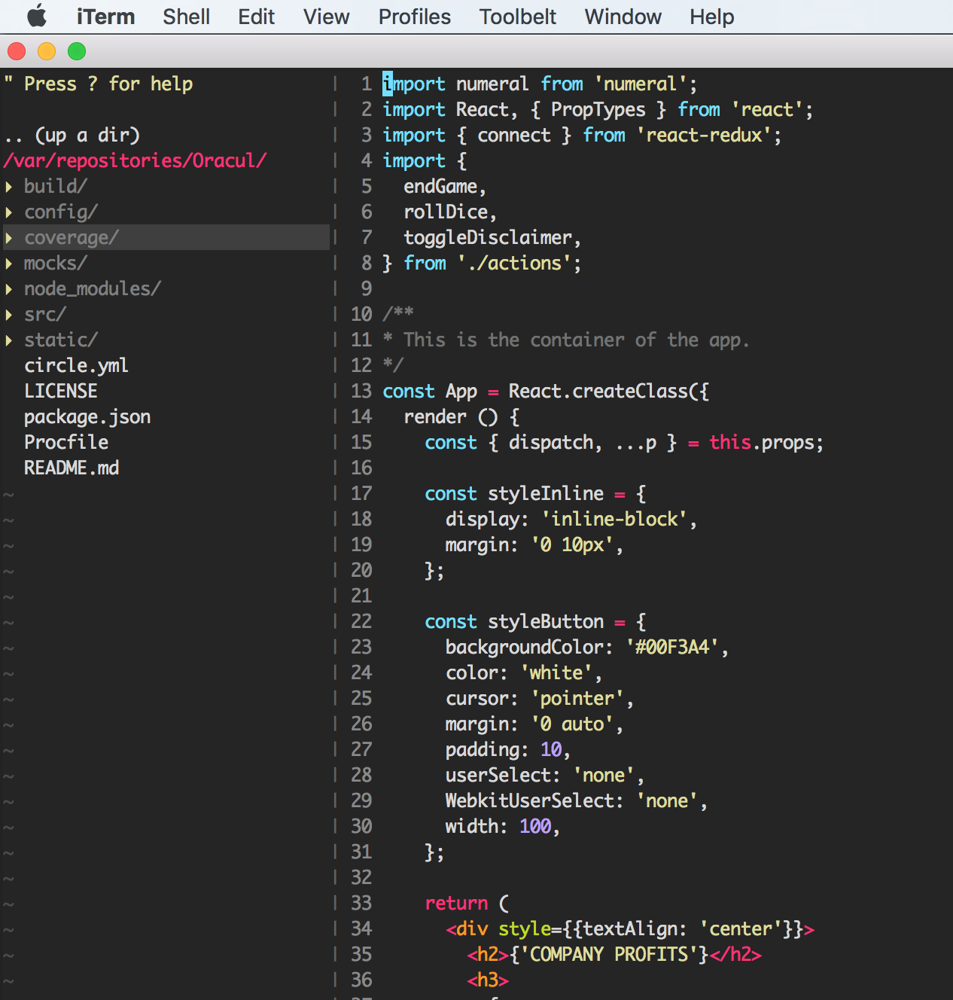

# Vimrc

> `.vimrc` Configuration file for vim editor in Unix.

## Preview



## Configuration

First install [Vundle](https://github.com/VundleVim/Vundle.Vim)


```
set nocompatible              " be improved, required
filetype off                  " required

" set the runtime path to include Vundle and initialize

set rtp+=~/.vim/bundle/Vundle.vim
call vundle#begin()

" alternatively, pass a path where Vundle should install plugins
" call vundle#begin('~/some/path/here')

" let Vundle manage Vundle, required

Plugin 'VundleVim/Vundle.vim'

" Color theme

Plugin 'crusoexia/vim-monokai'

" plugin on GitHub repo

Plugin 'tpope/vim-fugitive'

" NeerdTree
Plugin 'scrooloose/nerdtree.git'
autocmd bufenter * if (winnr("$") == 1 && exists("b:NERDTree") && b:NERDTree.isTabTree()) | q | endif " close vim if NERDTREE is the only window left


" Ctrl-P to search/open files
Plugin 'ctrlpvim/ctrlp.vim.git'
let g:ctrlp_map = '<c-p>' " Map :CtrlP
let g:ctrlp_cmd = 'CtrlP' " Map :CtrlP
let g:ctrlp_custom_ignore = {
  \ 'dir':  '\v[\/](\.git|node_modules|build)$',
  \ 'file': '\v\.(exe|so|dll)$',
  \ }

" Syntaxis checker
Plugin 'scrooloose/syntastic.git'
set statusline+=%#warningmsg#
set statusline+=%{SyntasticStatuslineFlag()}
set statusline+=%*
let g:syntastic_always_populate_loc_list = 1
let g:syntastic_auto_loc_list = 1
let g:syntastic_check_on_open = 1
let g:syntastic_check_on_wq = 0

" JS syntax highlighting
Plugin 'pangloss/vim-javascript'

" JSX highlighting. Depends on 'pangloss/vim-javascript'
Bundle 'mxw/vim-jsx'
let g:jsx_ext_required = 0 " to enable jsx in .js files
let g:syntastic_javascript_checkers = ['eslint'] " Use eslint

" Inserts pairs of quotes, brackets, braces
Plugin 'jiangmiao/auto-pairs.git'

" Autocomplete for JS
Plugin 'ternjs/tern_for_vim.git'
let g:tern_map_keys=1 " enables keybindings
let g:tern_show_argument_hints='on_hold' " display argument type hints when the cursor is left over a function

" Nerd tree tabs
Bundle 'jistr/vim-nerdtree-tabs'

" Cool status bar
Plugin 'vim-airline/vim-airline'

" All of your Plugins must be added before the following line
call vundle#end()            " required
filetype plugin indent on    " required
" To ignore plugin indent changes, instead use:
" filetype plugin on
"
" Brief help
" :PluginList       - lists configured plugins
" :PluginInstall    - installs plugins; append `!` to update or just :PluginUpdate
" :PluginSearch foo - searches for foo; append `!` to refresh local cache
" :PluginClean      - confirms removal of unused plugins; append `!` to auto-approve removal
"
" see :h vundle for more details or wiki for FAQ
" Put your non-Plugin stuff after this line


set number
set tabstop=2
set shiftwidth=2
set expandtab
set autoindent
set smarttab
set colorcolumn=80,100,120
set ruler
let mapleader = "-"
nnoremap <leader>w <c-w>w
syntax on
set t_Co=256
colorscheme monokai
```
